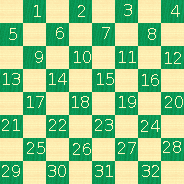

### Game notation

Men are placed on black cells of a board with positions being counted from upper left corner. 

__BLACK__

__WHITE__

A move is represented by a number of an initial cell followed with a dash and an ending cell. For example 22-18 might mark a move by a white opponent.

We will store a game in a single database row, updating the row every time a move is made. If a man was defeated, the notation specifies that by places a colon between moves. For example, 1:10 might represent a move by a black opponent where white have lost a man. More moves for one turn could be specified by a longer notation, for example 1:10:3.

### Database representation

Requirements
* A creation date on every move
* Composite key - game id + sequential id for a move
* Index on game id 
* Side on each move, because we store consecutive moves separately