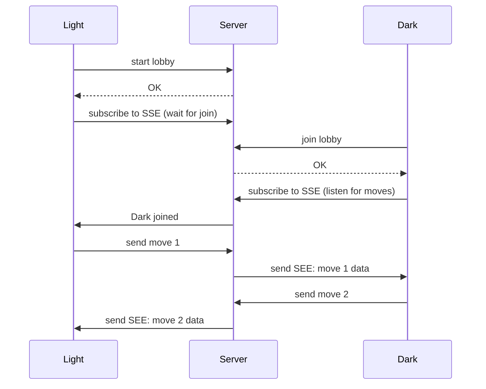

```mermaid
sequenceDiagram
    participant Light
    participant Server
    participant Dark

    Light->>Server: start lobby
    Server-->>Light: OK
    Light->>Server: subscribe to SSE (wait for join)
    
    Dark->>Server: join lobby
    Server-->>Dark: OK
    Dark->>Server: subscribe to SSE (listen for moves)
    Server->>Light:Dark joined

    Light->>Server: send move 1
    Server->>Dark: send SEE: move 1 data

    Dark->>Server: send move 2
    Server->>Light: send SEE: move 2 data

```
